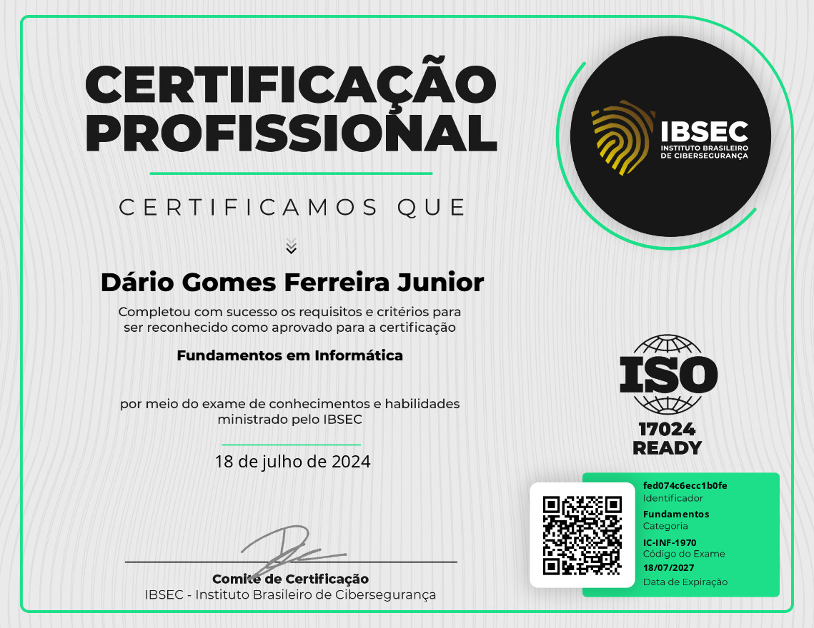

# Certificação: Fundamentos de Informática

  

**Identificador:** #fed074c6ecc1b0fe  
**Emitido Por:** IBSEC  
**Categoria:** Fundamentos  
**Código do Exame:** IC-INF-1970  
**Data da Emissão:** 18/07/2024  
**Data de Expiração:** 18/07/2027  

## Habilidades / Conhecimentos

- Habilidades em informática
- Conhecimentos em atalhos de teclado
- Habilidades em gerenciamento de programas no Windows
- Conhecimentos em anexar arquivos em e-mails
- Conhecimentos em endereços de e-mail e sites
- Habilidades em formatação de texto no Word
- Conhecimentos em sistemas operacionais para celular
- Habilidades em componentes de um computador
- Conhecimentos em protocolos de internet
- Habilidades em resolução de problemas técnicos

---

**Link da Certificação:** [Certificado Online](https://certs.ibsec.com.br?cert_hash=fed074c6ecc1b0fe)

Esta certificação atesta minhas habilidades e conhecimentos fundamentais em informática, abrangendo uma variedade de competências essenciais para o ambiente digital moderno.
